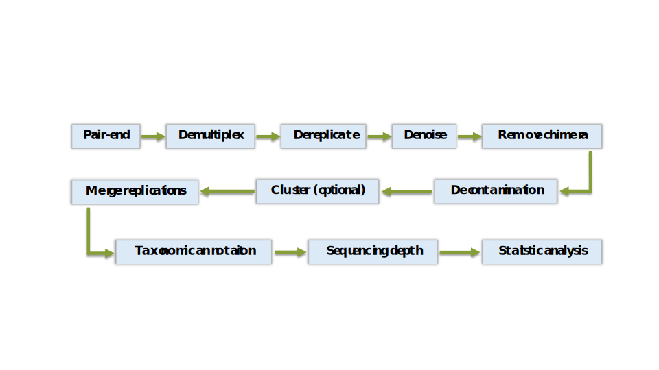

```{r setup, include=FALSE}
knitr::opts_chunk$set(collapse = TRUE, comment = "#>")
```

\

# Introduction

------------------------------------------------------------------------

## General pipe line

The image illustrates a general workflow for eDNA analysis.

{width="100%" height="auto"}

## Installation

For most systems, the package can be installed directly from the downloaded source file using the `install.packages()` function.

On `Windows`, the corresponding version of **Rtools** must be installed because the package contains `C++` code and uses `OpenMP`, which requires the toolchain provided by **Rtools**.

On `Linux`, users should ensure that `gcc/g++` are installed.

On both `Linux` and `Windows`, `OpenMP` acceleration is enabled by default.

On `macOS`, `OpenMP` support requires installing `libomp` and configuring the necessary environment variables in advance.

-   Install dependency

``` bash
brew install libomp
```


\

# Preparation
- Load a useful package
```{r, eval=FALSE}
library(tidyverse)
```

- Load tutorial files
Forward file
```{r, eval=FALSE}

fwd_f <- system.file("extdata", "trnL_25k_1.fq.gz", package = "METAeDNA")
fwd_f
```
Reverse file
```{r, eval=FALSE}
rev_f <- system.file("extdata", "trnL_25k_2.fq.gz", package = "METAeDNA")
rev_f
```
Demultiplexing table 
```{r, eval=FALSE}
primer_table_path <- system.file("extdata", "trnL_table.txt", package = "METAeDNA")
# file format
primer_table_path %>% read_tsv()

```
Control table
```{r , eval=FALSE}

control_table <- system.file("extdata", "control_table.csv", package = "METAeDNA") %>% read_csv()
control_table
```
Make a directory to store results
```{r , eval=FALSE}
if(!file.exists("/media/data/example/trnL"))
{
  dir.create("/media/data/example/trnL")  
}

```

# Paired-end merging

------------------------------------------------------------------------

Paired-end read merging is a critical pre-processing step in amplicon-based metabarcoding workflows, aiming to reconstruct full-length amplicon sequences from overlapping forward and reverse reads. In this workflow, paired-end FASTQ files are merged using the METAeDNA::pairend() function, which implements an overlap-based alignment strategy with explicit mismatch control and quality-aware scoring.

The algorithm first reverse-complements the second read (R2) and searches for a valid overlap between the two reads. Overlaps are required to exceed a minimum length (min_overlap) to ensure sufficient alignment confidence. Within the overlapping region, a limited number of mismatches (max_mismatches) are tolerated, allowing robustness to sequencing errors while preventing spurious merges.

When mismatches occur, base-level conflict resolution is performed using Phred quality scores: for each mismatched position, the nucleotide with the higher quality score is retained in the merged sequence. This quality-aware correction reduces the propagation of low-confidence sequencing errors into downstream analyses. In addition to hard mismatch thresholds, an overlap scoring scheme is applied. For each candidate overlap, a composite overlap score is calculated that penalizes mismatches according to a tunable penalty parameter (lambda). Only merged reads with an overlap score greater than or equal to a user-defined threshold (score_threshold) are retained. This scoring-based filtering provides finer control than mismatch counts alone and helps exclude ambiguous or weakly supported merges.

## Overlap score calculation

------------------------------------------------------------------------

For an overlap of length $L$, let $i = 1, \dots, L$ index positions within the overlap. The Phred quality for every overlapping position is calculated.

$$
Q_i = -10\log_{10}(e) 
$$

where e is the estimated probability of the base call being wrong. Then, the weight value ($w_i$) is calculated for every position.

$$
w_i = \frac{Q_{1,i} + Q_{2,i}}{2}.
$$

The total overlap weight is

$$
W_{\text{total}} = \sum_{i=1}^{L} w_i .
$$

Define the mismatch indicator

$$
\delta_i =
\begin{cases}
1, & \text{if } s_{1,i} \neq s_{2,i}, \\
0, & \text{if } s_{1,i} = s_{2,i}.
\end{cases}
$$

The accumulated penalty weight is

$$
W_{\text{penalty}} =
\begin{cases}
\sum_{i=1}^{L} \delta_i \, w_i, & \lambda = 0, \\
\sum_{i=1}^{L} \delta_i \, (\lambda \, w_i), & \lambda > 0.
\end{cases}
$$

The normalized overlap score is defined as

$$
\text{OverlapScore} =
\begin{cases}
1 - \dfrac{W_{\text{penalty}}}{W_{\text{total}}}, & W_{\text{total}} > 0, \\
0, & W_{\text{total}} = 0.
\end{cases}
$$

To efficiently handle large sequencing datasets, reads are processed in batches (batch_size) and merged in parallel using multiple CPU threads (n_threads). This design minimizes memory overhead while maintaining high throughput, making the function suitable for large-scale metabarcoding or eDNA datasets.

The resulting merged reads are written to a FASTQ file, with sequence identifiers annotated to include overlap length, mismatch count, and overlap score.

```{r, eval=FALSE}
METAeDNA::pairend(
  fwd_f,
  rev_f,
  "/media/data/example/trnL/pairend.fastq",
  min_overlap = 10L,
  max_mismatches = 4L,
  score_threshold = 0.8,
  lambda = 0.1,
  n_threads = 32L,
  batch_size = 1000000L
)
```

\

# Demultiplexing

------------------------------------------------------------------------

The `demultiplex` function separates sequencing reads according to a user-provided marker table. The marker file can be provided in either tab-delimited or comma-separated format and contain the following columns: exp, sample, tags, forward_primer, and reverse_primer.

The `exp` column specifies the library or experimental group to which each `sample` belongs, while the `sample` column indicates the name of each individual PCR sample. The `tags` column defines the nucleotide tags used for sample identification and must be formatted as `tag:tag` (e.g., `ATCG:TGGC`). If no tag sequences were used during library preparation, demultiplexing can be performed without tags by setting `with_tag = FALSE`.

The `forward_primer` and `reverse_primer` columns specify the primer sequences used for amplification and are employed to identify and assign reads to their corresponding samples during the demultiplexing process. Here is an example:

| exp  | sample | tags              | forward_primer       | reverse_primer         |
|---------------|---------------|---------------|---------------|---------------|
| trnL | F001   | tccgacta:tccgacta | GGGCAATCCTGAGCCAA    | CCATTGAGTCTCTGCACCTATC |
| trnL | F002   | tgcctgca:tgcctgca | GGGCAATCCTGAGCCAA    | CCATTGAGTCTCTGCACCTATC |
| trnL | F003   | cgtcgcaa:cgtcgcaa | GGGCAATCCTGAGCCAA    | CCATTGAGTCTCTGCACCTATC |
| trnL | F004   | ggtcagta:ggtcagta | GGGCAATCCTGAGCCAA    | CCATTGAGTCTCTGCACCTATC |
| trnL | F005   | acgcggca:acgcggca | GGGCAATCCTGAGCCAA    | CCATTGAGTCTCTGCACCTATC |
| trnL | F006   | gaagctga:gaagctga | GGGCAATCCTGAGCCAA    | CCATTGAGTCTCTGCACCTATC |
| ...  | ...    | ...               | ...                  | ...                    |
| 18S  | F101   | aacattga:aacattga | CCAGCASCYGCGGTAATTCC | ACTTTCGTTCTTGAT        |
| 18S  | F102   | aaccaaga:aaccaaga | CCAGCASCYGCGGTAATTCC | ACTTTCGTTCTTGAT        |
| 18S  | F103   | agtgaaga:agtgaaga | CCAGCASCYGCGGTAATTCC | ACTTTCGTTCTTGAT        |
| 18S  | F104   | ggtctcca:ggtctcca | CCAGCASCYGCGGTAATTCC | ACTTTCGTTCTTGAT        |
| 18S  | F105   | agtgccaa:agtgccaa | CCAGCASCYGCGGTAATTCC | ACTTTCGTTCTTGAT        |
| 18S  | F106   | acggcgaa:acggcgaa | CCAGCASCYGCGGTAATTCC | ACTTTCGTTCTTGAT        |

The matching procedure first searches for primer sequences within each read. A read is considered a candidate for further processing only if the primer is detected and the number of mismatches does not exceed the user-defined threshold. When tag sequences are specified, an additional matching step is applied to the 5′ end of the primer region to verify the presence of the corresponding tag.

Primer matching is performed using a bitwise Shift-Or algorithm, which enables efficient approximate string matching while allowing a controlled number of mismatches.

Function usage:

```{r, eval=FALSE}
METAeDNA::demultiplex(
  "/media/data/example/trnL/pairend.fastq",
  primer_table = primer_table_path,
  "/media/data/example/trnL/identified.fas",
  "/media/data/example/trnL/unidentified.fas",
  n_threads = 32
)
```

\

# Dereplication

------------------------------------------------------------------------

The dereplication step collapses identical nucleotide sequences into unique sequence representatives while aggregating their abundances across samples and experimental groups. This procedure reduces data redundancy, decreases file size, and substantially improves the efficiency of downstream analyses such as denoising, chimera detection, and clustering.

The `dereplicate` function reads an input FASTA (or FASTQ-derived FASTA) file and identifies sequences that are identical at the nucleotide level. For each unique sequence, all occurrences are merged, and the total read count is calculated as the sum of counts across all PCR samples. Sample- and experiment-level abundance information is preserved and stored in a structured JSON block appended to each FASTA header.

During dereplication, sequence headers are parsed to extract existing metadata, including sample identifiers, experimental grouping, and any previously recorded statistics (e.g., from paired-end merging or demultiplexing). These metadata are consolidated so that the resulting unique sequences retain a complete record of their provenance. The output FASTA file contains one entry per unique sequence, with the `size=` field updated to reflect the total read count.

To ensure scalability for large datasets, dereplication is performed in batches and supports multi-threaded processing via OpenMP when available. Each batch is processed independently, and partial results are merged into a global sequence table to minimize memory overhead.

The resulting dereplicated FASTA file serves as the standardized input for subsequent steps in the METAeDNA pipeline, such as denoising and chimera removal.

```{r, eval=FALSE}
METAeDNA::dereplicate(
  input_fasta  = "/media/data/example/trnL/identified.fas",
  output_fasta = "/media/data/example/trnL/unique.fas",
  n_threads = 32
)
```

\

# Denoising

------------------------------------------------------------------------

The `denoise` function is designed to identify and remove PCR- or sequencing-derived error sequences by integrating sequence similarity and abundance information across PCR replicates. Sequence headers are parsed to extract per-experiment and per-sample read counts generated in earlier steps (`dereplicate`). Input sequences are first filtered according to basic length and abundance criteria:

-   Sequences with lengths outside the user-defined range (sequence_min_L to sequence_max_L) are discarded. It is beneficial for excluding off-target fragments.

-   Sequences with total read counts below min_count (summed across all PCRs) are removed. This is advantageous for filtering out artifacts (or contamination) introduced by PCR or sequencing errors.

This initial filtering reduces the size of the sequence set and prevents low-abundance artifacts from dominating subsequent similarity searches. For each experiment–sample combination (PCR), the remaining sequences are compared to identify local neighbors based on sequence similarity.

Two sequences are considered neighbors if they satisfy either of the following conditions:

-   At most max_diff nucleotide substitutions

-   At most max_indel insertions or deletions

They co-occur in the same PCR with non-zero read counts For each pair of neighboring sequences within a PCR, a **directed edge** is assigned based on their relative abundances:

Let

-   $C_{\text{high}}$ be the read count of the more abundant sequence
-   $C_{\text{low}}$ be the read count of the less abundant sequence

A directed edge

$$\text{low abandance} \rightarrow \text{high abundance}$$

is created if

$$\frac{C_{\text{low}}}{C_{\text{high}}} < \text{threshold}$$

This rule reflects the assumption that low-abundance variants closely related to a high-abundance sequence are more likely to represent PCR or sequencing errors. This algorithm was proposed by [Boyer et al. (2016)](https://doi.org/10.1111/1755-0998.12428).

Sequence similarity is evaluated using optimized bit-encoded representations, and when available, AVX2 vector instructions are used to accelerate comparisons and it might be more effective for long sequence comparison, and can be enabled or disabled via an `enable_avx2` option.

```{r, eval=FALSE}
METAeDNA::denoise(
  input_fasta = "/media/data/example/trnL/unique.fas",
  output_fasta = "/media/data/example/trnL/denoise.fas",
  sequence_min_L = 1L,
  sequence_max_L = 1000L,
  keep_internal = FALSE,
  min_count = 1L,
  threshold = 0.5,
  n_threads = 32,
  enable_avx2 = TRUE
)
```

\

# Remove chimera

------------------------------------------------------------------------

PCR amplification can generate chimeric sequences when partially extended amplicons re-anneal to different template molecules in subsequent PCR cycles. These chimeras are artificial recombination products and can lead to inflated estimates of species richness as well as biased downstream ecological analyses. To minimize such artifacts, chimeric sequences are removed from the denoised FASTA file using the UCHIME detection algorithm implemented in [**VSEARCH**](https://github.com/torognes/vsearch).

In this workflow, **VSEARCH** is directly integrated into the pipeline through a dedicated wrapper function, allowing users to perform chimera removal with a single command. Before running this step, users should ensure that **VSEARCH** has been installed and that the directory containing the executable is either explicitly specified or included in the system environment variables. If **VSEARCH** is available in the system path, the function will automatically detect and invoke the executable without additional configuration.

```{r, eval=FALSE}
METAeDNA::vsearch_remove_chimeras(
  vsearch_exe_path  = NULL,
  input_fasta = "/media/data/example/trnL/denoise.fas",
  output_fasta = "/media/data/example/trnL/denoised_removed_chimeras.fas")
```

\

# FASTA to table

------------------------------------------------------------------------

In this section, we will read the denoised files into R, and then expand the sequence counts for each sample based on the JSON annotation block.

```{r, eval=FALSE}
seq_table <- METAeDNA::fasta_to_table(
  "/media/data/example/trnL/denoise.fas",
  threads = 4
)
```

\

# Decontamination

------------------------------------------------------------------------

At this step, users can provide a table via `control_table` parameter that defines the relationship between samples and their corresponding blank controls. The `decontamination` function uses this table to perform contamination removal based on sample–blank associations.

The input table is used to explicitly specify. Each row corresponds to one tag, representing a single PCR reaction. For each PCR reaction (i.e. each tag), which biological sample it represents and which blank controls should be used for contamination assessment.

Table columns requirements `sample | tag | group | category | <blank control columns>`

-   `sample` The name of the biological sample associated with the PCR reaction.

-   `tag` The barcode/tag sequence used for the PCR reaction. This value must be consistent with the tag definitions used in the demultiplexing primer table.

-   `group` The group to which the sample belongs (e.g. library, batch, or experimental group). If no grouping is required, all entries can be assigned the same arbitrary value, but this field must not be empty.

-   `Blank control columns` One or more columns representing different types of blank controls, such as filtration blanks, extraction blanks, or PCR blanks. Column names should contain only letters, numbers, and underscores (no special characters except underscores). And specify these columns using the `control_names` parameter. The value in each blank control column indicates the sample name of the blank control associated with the corresponding tag.

-   `category` Indicates whether the tag represents a biological sample or a blank control.

Here is an example

| sample | tag  | group | category | EB  | FB  | PB  |
|--------|------|-------|----------|-----|-----|-----|
| S1     | F001 | exp1  | sample   | EB1 | FB1 | PB1 |
| S2     | F002 | exp1  | sample   | EB1 | FB1 | PB1 |
| S3     | F003 | exp1  | sample   | EB1 | FB1 | PB1 |
| S4     | F004 | exp1  | sample   | EB2 | FB2 | PB2 |
| S5     | F005 | exp1  | sample   | EB2 | FB2 | PB2 |
| S6     | F006 | exp1  | sample   | EB2 | FB2 | PB2 |
| ...    | ...  | ...   | ...      | ... | ... |     |
| EB1    | F101 | exp1  | EB       | NA  | NA  | NA  |
| FB1    | F102 | exp1  | FB       | NA  | NA  | NA  |
| PB1    | F103 | exp1  | PB       | NA  | NA  | NA  |
| EB2    | F104 | exp1  | EB       | NA  | NA  | NA  |
| FB2    | F105 | exp1  | FB       | NA  | NA  | NA  |
| PB2    | F106 | exp1  | PB       | NA  | NA  | NA  |

```{r, eval=FALSE}
seq_table <- METAeDNA::decontamination(seq_table, control_table, control_names = c("PB", "EB", "FB"))
```

\

# Cluster

The `vsearch_cluster_table` function performs clustering by calling **VSEARCH**. The `seq_table` parameter is the table after contamination removal, `vsearch_exe_path` specifies the directory where the **VSEARCH** executable file is located, and `output_path` is the output directory. `identity` is the clustering threshold, default is 0.97.


```{r, eval=FALSE}
seq_table_cluster <- METAeDNA::vsearch_cluster_table(seq_table, output_path = "/media/data/example/trnL/denoised_removed_chimeras.fas" )
```

\

# Merging of technical repetitions

------------------------------------------------------------------------

## Overview

The eDNA metabarcoding datasets commonly include multiple technical PCR replicates for each biological sample. \| These replicates are intended to reduce stochastic amplification effects, but they must be merged prior to downstream ecological or statistical analyses.\
The function `merge_replicate()` provides a flexible framework to merge technical PCR replicates based on **Relative Read Abundance (RRA)**. It supports multiple merging strategies and optional filtering rules to control replicate consistency.

## Merging Strategies

------------------------------------------------------------------------

The `method` argument controls how replicate RRA values are combined:

-   **`"mean_rra"`**\
    The mean RRA across all technical replicates.

-   **`"max_rra"`**\
    The maximum RRA observed among replicates.

-   **`"both_occur"`**\
    A sequence is retained only if it appears (abundance \> 0) in at least `repeat_times` replicates. Otherwise, the merged abundance is set to zero.

## Input Requirements

------------------------------------------------------------------------

### Sequence Table (`seq_table`)

A data frame where each row represents a sequence (OTU/ASV).

```{r, eval=FALSE}

```

\

# Taxonomic annotation

## Download and prepare the NCBI BLAST database

```{r, eval=FALSE}
METAeDNA::download_blast_db(database_dir = "F:/test/nt",db = "nt")
```

## Decompress database

```{r, eval=FALSE}
METAeDNA::prepare_blast_database(files_dir = "F:/test/nt",database_dir = "F:/test/nt_db",threads= 20)
```

## Run BLAST

```{r, eval=FALSE}
blastn_cmd(input = "~/test.fas", output = "~/query_res.csv",  database = "/media/data/share_database/ncbi_nt/unzip_db/nt", blast_exe_path = "/share/packages/ncbi-blast/2.16/bin/", threads = 32)
```


## Make a taxonomy SQL database

The function `make_database()` constructs an SQLite database from NCBI taxonomy resources, including the taxonomy dump (`nodes.dmp`, `names.dmp`) and optional accession-to-taxid mapping files. The resulting database enables fast and reproducible taxonomic queries for downstream analyses. The database is built from the following official NCBI resources:

-   **Taxonomy dump file (taxdump.tar.gz), contains:**
    -   `nodes.dmp`
    -   `names.dmp`
    -   FTP: <https://ftp.ncbi.nlm.nih.gov/pub/taxonomy/>
-   **Accession to taxid mapping**
    -   `nucl_gb.accession2taxid.gz`
    -   `nucl_wgs.accession2taxid.gz` (optional, WGS accessions)
    -   FTP: <https://ftp.ncbi.nlm.nih.gov/pub/taxonomy/accession2taxid/>

You can use the `make_database()` for automatic downloads or download the files manually. If you choose manual download, save them to your specified directory and the function will detect them automatically. Just remember to set download = FALSE.

------------------------------------------------------------------------

## Function Description

`make_database()` supports flexible database construction modes:

-   taxonomy-only database
-   accession-to-taxid database
-   combined taxonomy and accession database
-   optional inclusion of WGS accessions
-   optional indexing for faster query performance

Large files are processed in chunks to reduce memory usage.

In constructed database, taxonomic information can be queried by `taxid` or `species name`, and optionally by `accession` number or taxonomic identifiers when an `accession2taxid` database is available.

------------------------------------------------------------------------

## Usage

- Download & make database  

```{r, eval=FALSE}
make_database(
  taxonomy   = TRUE,
  accession  = TRUE,  
  include_WGS = FALSE,  
  taxdump_dir = "/data/ncbi_taxdump",
  sql_path    = "/data/ncbi_taxdump/taxdump.sqlite",
  overwrite   = TRUE
 )
```

## Query taxonomy

- by taxid

You can query taxonomic lineage by using taxid. The input can be a numeric vector.

```{r, eval=FALSE}
get_taxonomy(sql_path = "/media/data/luoyuan/Downloads/tax_database.sql", tax_ids = c(9606, 1779274 ), dereplicate = F)
```

- Species name 

Species name query is also provide, the input could accept a character vector.

```{r, eval=FALSE}

get_taxonomy(sql_path = "/media/data/luoyuan/Downloads/tax_database.sql", tax_names = c("Homo sapiens", "Acer acutum"), dereplicate = F)

```

## Use last common ancestor method 
To improve the robustness of taxonomic assignments and to reduce biases arising from database heterogeneity and annotation uncertainty, we applied the Lowest Common Ancestor (LCA) approach to merge the taxonomic annotation results. Specifically, for each sequence (or OTU/ASV), all candidate taxonomic assignments obtained from the reference database were first collected. The lowest taxonomic node shared by these candidates within the taxonomic hierarchy was then identified, and the corresponding rank was assigned as the final taxonomic annotation for that sequence.

```{r, eval=FALSE}
lca_data <- find_lca(taxonomy_data)
```


## Combine taxonomy to sequences/OTU

```{r, eval=FALSE}

```

\

# Sequencing depth evaluation

```{r, eval=FALSE}

```
